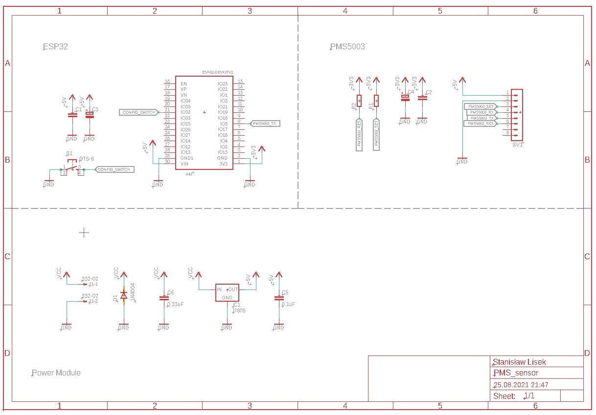

# ESP32 Air Quality monitor system

  
  
  

Based on ESP32 as a controler and PMS5003 as a sensor used for monitoring of air quality. 
For dysplaying data it uses a HTTP site (hosted by ESP) 

## Feature
- data dysplayed at web serwer at ardess ESP32-ip/main
- configuration mode:
   - to enter configuration press button 1 while powering up device
   - it allow you to modyfy wifi password and ssid and enable sending request with data form sensor 
     to specify web serwer (Feature design to use with my wireless display - comming soon)
- ability to send httpd requests to upload data for specyfy web serwer

## Schematic of device

## TODO
- format the code
- prepare and upload an schematic of device
